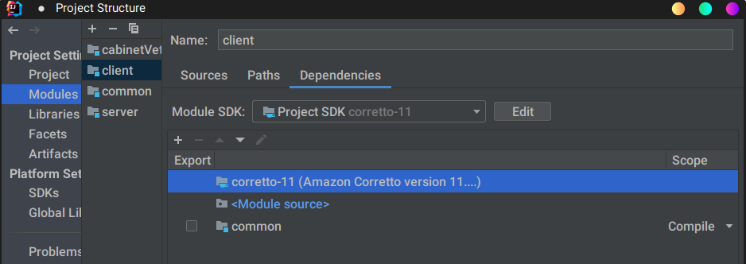

# Architectures Distribuées
## TP1: Java RMI, Cabinet Vétérinaire

### Projet rendu Par AMAH GNIMDOU RICHARD et Fanus Ludovic
Le code source du projet se trouve sur ce [Dépôt](https://github.com/krxdow/M1/tree/master/Architectures%20Logicielles%20Distribu%C3%A9es/RMI/cabinetVet)  
Un Diagrame [UML](https://github.com/krxdow/M1/blob/2efcf8f71200d0e93a37af3df434ce0c3d03da85/Architectures%20Logicielles%20Distribu%C3%A9es/RMI/cabinet/UML.png)


# Instruction Compilation et Lancement
Simplement, récupérer les fichiers .jar dans le dossier cabinet et exécuter comme ci-dessous
````shell
java -jar server.jar
java -jar client.jar
````

Autrement se placer dans le dossier racine du projet **cabinet** et exécuter les commandes suivantes


```shell
# compilation client
javac server/src/*.java -sourcepath common/src/ -d classesServer
```

```shell
# compilation client
javac client/src/*.java -sourcepath common/src/ -d classesClient
```

```shell
# lancement du server
cd classesServer
java Server Server.class
```

```shell
# lancement du client
cd classesClient
java Client Client.class
```


## **Une première version simple**
----
## **Une premiere version simple**
#### 1. Version de base

L'ensemble du projet est fait à l'aide de l'environment de développement intégré IntelliJ

```shell
.
├── client
│   ├── client.iml
│   └── src
│       └── Client.java
├── common
│   ├── common.iml
│   └── src
│       ├── Espece.java
│       ├── IAnimal.java
│       ├── ICabinetVeterinaire.java
│       ├── IEspece.java
│       └── ISuiviAnimal.java
├── readme.md
└── server
    ├── security.policy
    ├── server.iml
    └── src
        ├── Animal.java
        ├── CabinnetVeterinaireImpl.java
        ├── server.iml
        ├── Server.java
        └── SuiviAnimal.java
```
Dans un but de compartimenter le projet, le **server**, le **client** et **common** sont des modules.  
 **server** et client ont accesé à au module **common**, les modules **server** et **client** ne se voient pas

Configuration



#### 2. Gestionnaire de securité

Le RMISecurityManager applique la politique de sécurité pour les classes qui sont chargées en tant que stubs pour les objets distants,(ici dans notre cas la classe Animal )en remplaçant toutes les méthodes de contrôle d'accès pertinentes du SecurityManager. 
Par défaut, les objets stub ne sont autorisés qu'à effectuer des opérations de définition de classe et d'accès aux classe

La gestion des droits se fait à traver le fichier [security.policy](https://github.com/krxdow/M1/blob/433a467fe5d48ee86732bef34bc78a34d0f7f553/Architectures%20Logicielles%20Distribu%C3%A9es/RMI/cabinet/server/src/security.policy)
```
grant {
  permission java.security.AllPermission;
};
```
Une première façon via le code avec l’objet RMISecurityManager  
petite astuce, la méthode setProperty, accepte seulement le chemin absolu, afin que le projet soit exportable, les méthodes la classe Paths sont utilisées.
```java
import java.nio.file.Paths;
import java.rmi.RMISecurityManager;
import java.rmi.registry.LocateRegistry;
import java.rmi.registry.Registry;


public class Server {

 public static void main(String[] args) {

  //Obtention du chemin absolu du fichier par rapport à sa position relative
  Path policyFilePathURI = Paths.get("server/src/security.policy").toAbsolutePath().normalize();
  System.setProperty("java.security.policy", policyFilePathURI.toString());
  
  try {
   if (System.getSecurityManager() == null) {
       // Crée un nouveau gestionnaire de sécurité s'il n'y a pas encore de gestionnaire de securité
       System.setSecurityManager(new RMISecurityManager());
   }
  } catch (Exception e) {
   e.printStackTrace();
  }
 }
}
```

Il est aussi possible d'activer un security manager en utilisant simplement l'option `-Djava.security.manager` de la JVM. 
```shell
cd classesServer
java -Djava.security.manager -Djava.security.policy=../server/src/security.policy Server Server.class
```
via IntelliJ


#### 3. Classe Suivi
On crée une [interface](https://github.com/krxdow/M1/blob/433a467fe5d48ee86732bef34bc78a34d0f7f553/Architectures%20Logicielles%20Distribu%C3%A9es/RMI/cabinet/server/src/SuiviAnimal.java) et son [implementation](https://github.com/krxdow/M1/blob/433a467fe5d48ee86732bef34bc78a34d0f7f553/Architectures%20Logicielles%20Distribu%C3%A9es/RMI/cabinet/common/src/ISuiviAnimal.java) 

```java
public interface ISuiviAnimal extends Remote {
    String getSuivi() throws RemoteException;
    void setSuivi(String s)  throws RemoteException;
    }
```

```java
public class SuiviAnimal extends UnicastRemoteObject implements ISuiviAnimal {
    private String suivi;
    public SuiviAnimal() throws RemoteException {}
    public SuiviAnimal(String suivi) throws RemoteException {this.suivi = suivi;}
    public String getSuivi() throws RemoteException {return this.suivi;}
    public void setSuivi(String suivi) throws RemoteException {this.suivi = suivi;}
}
```


#### 4. Copies Espese
[Interface](https://github.com/krxdow/M1/blob/be6eec7b1d84a9a2c9f76ca0e686c72aa7950bb7/Architectures%20Logicielles%20Distribu%C3%A9es/RMI/cabinetVet/common/src/IEspece.java) et [l’Implementation](https://github.com/krxdow/M1/blob/be6eec7b1d84a9a2c9f76ca0e686c72aa7950bb7/Architectures%20Logicielles%20Distribu%C3%A9es/RMI/cabinetVet/common/src/Espece.java)


La classe `Espese` (placé dans le module **common** ) est passée par valeur et nom par réference pour cela, les valeurs doivent être de types primitifs et l’objet doit implementé l'interface sérialisable.
``` java
public interface IEspece extends Serializable {...}
```
La classe `Espece` est convertie en un flux d'octets et ensuite réassemble les octets en une copie identique de l'objet d'origine. 

```java
public  class Client { 
    IAnimal stub = (IAnimal) registry.lookup("Animal");
    stub.setName("zack");
    Espece especeCopy = new Espece("canus lupus", 15);
    stub.setEspeseObj(especeCopy.getname(),especeCopy.getlifeExpectancy());
}
```
## **L'objet distrubié ICabinetVeterinaire**

[Interface](https://github.com/krxdow/M1/blob/be6eec7b1d84a9a2c9f76ca0e686c72aa7950bb7/Architectures%20Logicielles%20Distribu%C3%A9es/RMI/cabinetVet/common/src/ICabinetVeterinaire.java)  
L'objet `ICabinetVeterinaire` qui sera distribué permettra à tout client distant de pouvoir ajouter des patients, les supprimer, d'obtenir le nombre de patients enregistrés par le cabinet via les 
vétérinaires attachés au cabinet (un veterinaire pourra voir les patients enregistrés par ses paires du cabinet), de rechercher des patients (par leurs noms), de lier un vétérinaire qui est en cours d'utilisation de  l'application.
Enfin, le cabinet dispose d'une méthode permettant à quiconque l'invoque avec un seuil (en paramettre) de pouvoir envoyer des alertes de seuil aux clients qui sont liés au même cabinet quand ils utilisent l'application.

```java
public interface ICabinetVeterinaire extends Remote{
    // Recherche de patient
    public List<IAnimal> searchAllAnimal(String name) throws RemoteException;
    public List<IAnimal> searchAllAnimal() throws RemoteException;
    
    // Ajout de patient
    int addPatient(String name, String ownerName, String speciesName, int speciesAverageLife, String race, String state) throws RemoteException;
    
    // Liaison et Détachement de client vétérinaire connecté au cabinet
    public void bindClientToCabinet(IDistributedClient client) throws RemoteException;
    public void unbindClientToCabinet(IDistributedClient client) throws RemoteException;
    
    // Envoi d'alerte
    void sendAlert(int threshold) throws RemoteException;
    
    // Obtention du nombre total de patients du cabinet
    int getCurrentPatientNumber()throws RemoteException;
    
    // Suppression de patient (par le nom complet)
    int deletePatient(String fullName) throws RemoteException;
}
```
***Remarque***
> La méthode de recherche renvoi une liste de patients potentiellement recherchés, car elle prend en compte le cas ou le vétérinaire dispose un uniquement du nom du patient et n'a pas son nom complet (nom du patient combiné au nom de son maître) au moment où il recherche le patient. Ceci peut aider le veterinaire à obtenir le nom complet du patient afin d'obtenir le dossier du patient.


[L’Implémentation](https://github.com/krxdow/M1/blob/be6eec7b1d84a9a2c9f76ca0e686c72aa7950bb7/Architectures%20Logicielles%20Distribu%C3%A9es/RMI/cabinetVet/server/src/CabinnetVeterinaireImpl.java)

Le serveur implémente l'objet `ICabinetVeterinaire` qui permet en définissant les méthodes, en d'autres termes l'opérations des services offerts par l'objet distribué.
```java
public class CabinnetVeterinaireImpl extends UnicastRemoteObject implements ICabinetVeterinaire {
 ...
}
```

## **Création de Patient**
La création d'un patient ou enregistrement d'un nouveau patient se fait au niveau du client en appelant la méthode distante ***addPatient()***, qui retourne 0 si l'ajout à été réussi sans problème.

## **Téléchargment Du Codebase**
Le codebase est un projet contenant les fichers communs au client et au serveur. C'est ce projet qui contient notamment les interface des Objets distants et les classes des objets serializables.
La mise en place d’un CodeBase permettant de charger dynamiquement les classes se fait en spécifiant la propriété `java.rmi.server.codebase` sur le serveur et dont l'accès est conditioné par les permissions définies dans le gestionnaire de sécurité du serveur sur ses fichers.

```java
public class Server {
 public Server() {
 }

 public static void main(String[] args) {
  try {

   URI commonDirectoryPath = Paths.get("../common/src").toUri().normalize();
   System.setProperty("java.rmi.server.codebase", commonDirectoryPath.toString());
  }
  ...
 }
```

## **Gestion Des Alertes**
Les alertes sont un mécanimse permettant de notifier chaque vétérinaire d'un même cabinet et qui utilise l'application au préalable au moment du franchissement d'un seuil et de l'envoi de l'alerte.
Ici, nous avons implementé ce mécanisme directement dans l'implementaion (`CabinetVeterinaireImpl`) de l'objet distribué `ICabinetVeterinaire`, qui appelle une méthode distante du client qui est transformé en objet distribué(`IDistributedClient`),
Cette méthode reçoit la valeur (passage par valeur ou par copie) du seuil et affiche un message de notification contenant ce seuil.

## **Définition de la méthode d'alerte au niveau du client**

```java
 public void checkAlert(int threshold) throws RemoteException {
        ...
    }
```
## **Appel de la méthode distante par CabinetVeterinaireImpl**

```java
int threshold = this.patients.size();
            switch (threshold) {
                case 100:
                    sendAlert(1);
                    System.err.println("Le seuil est a 100 patients");
                    break;
                case 500:
                    sendAlert(500);
                    System.err.println("Le seuil est passe' a 100 patients");
                    break;
                case 1000:
                    sendAlert(1000);
                    System.err.println("Le nouveau seuil est a 1000 patients");
                    break;
                default:
                    ;
```

Notons aussi que `CabinetVeterinaireImpl` affiche des messages (logs) sur le serveur qui l'implémente. 