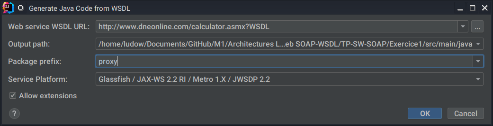

# TP service web SOAP
## Exercice 1 : Utilisation de service web existant.
_Approche ascendante pour le développement de services Web JAX-WS_

Configuration des dépendances mavem
```xml
    <dependencies>
        <!-- https://mvnrepository.com/artifact/jakarta.xml.ws/jakarta.xml.ws-api -->
        <dependency>
            <groupId>jakarta.xml.ws</groupId>
            <artifactId>jakarta.xml.ws-api</artifactId>
            <version>4.0.0</version>
        </dependency>
        <!-- https://mvnrepository.com/artifact/com.sun.xml.ws/jaxws-tools -->
        <dependency>
            <groupId>com.sun.xml.ws</groupId>
            <artifactId>jaxws-tools</artifactId>
            <version>4.0.0</version>
        </dependency>
    </dependencies>
```

---

- Recuperation du WSDL 
  * via IntelliJ  Se placer sur un dossier du projet et clicker sur
    * **Tools > XML WebServices ans WSDL > Generate Java Code from WSDL**
    
  *  via la ligne de commande 
  ```shell
  wsimport -p web.service.client "http://www.dneonline.com/calculator.asmx?WSDL"
  ```
  * ou avec un plugin de [maven](https://www.mojohaus.org/jaxws-maven-plugin/wsimport-mojo.html) à traver le fichier pom.xml
    ```xml
    <plugin>
        <groupId>org.codehaus.mojo</groupId>
            <artifactId>jaxws-maven-plugin</artifactId>
            <version>2.5</version>
            <executions>
                <execution>
                    <goals>
                        <goal>wsimport</goal>
                    </goals>
                </execution>
            </executions>
            <configuration>
            <wsdlLocation>/test.wsdl</wsdlLocation>
             <wsdlDirectory>${project.basedir}/src/main/resources/</wsdlDirectory>
            <extension>true</extension>
            </configuration>
    </plugin>
    ```
Apres une modification du fichier pom.xml Generate Source and Update Folder

---
Décryptage du WSDL pour guider à la recuperation du proxy et implementation

```xml
<wsdl:service name="Calculator">
  <wsdl:port name="CalculatorSoap" binding="tns:CalculatorSoap">
    <soap:address location="http://www.dneonline.com/calculator.asmx"/>
  </wsdl:port>
  <wsdl:port name="CalculatorSoap12" binding="tns:CalculatorSoap12">
    <soap12:address location="http://www.dneonline.com/calculator.asmx"/>
  </wsdl:port>
</wsdl:service>
```
Mise en place d'une instance calculator et l'implementation du proxy dans le fichier [Main.java]()