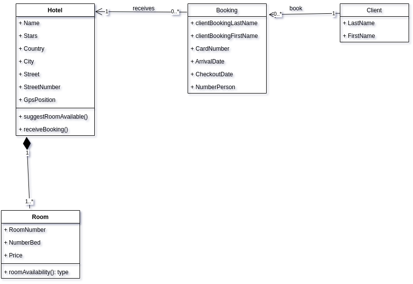

# TP WEB SERVICE SOAP: CAS DE RESERVATION D'HOTEL 
## Premiere version, non distribuee 

Dans cette premiere version, l'accent est mis sur une implementation d'un minimum de service permettant a un utilisateur (client) de simuler une reservation au d'un hotel en utilisant des informations de recherche fournies par le client.

## <ins> Diagram UML </ins>

Notre systeme basic est constitue' d'hotel qui contient des chambres, de client qui fait des reservations aupres d'hotel.
Un hotel est caracterise' ici par son nom, son nombre d'etoiles, le pays, la ville dans laquelle il est implante', ainsi que les complements de son adresse.

Les informations minimales requises pour faire une reservation aupres d'un hotel sont les nom et prenom de client principal qui sera heberge ou qui a fait la reservation, avec les informations de la carte bancaire utilisee pour cette reservation. La reservation est faite sur une plage de date determinee par la date d'arrivee a l'hotel et la date de depart de l'hotel.
Enfin la reservation est faite pour un nombre de personnes.

Nous offrons une interface minimale a l'utilisateur afin de pouvoir montrer la consommation du service web mis en place jusqu'ici.
