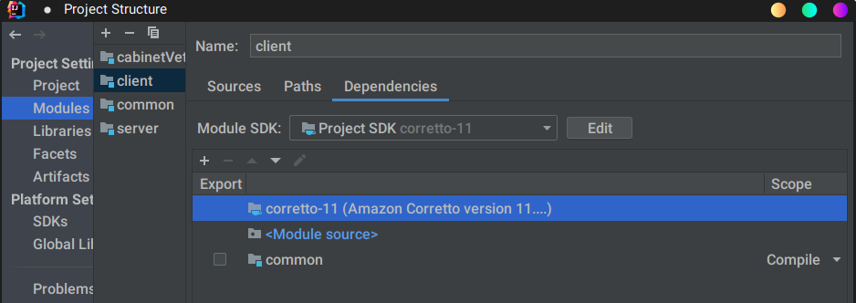
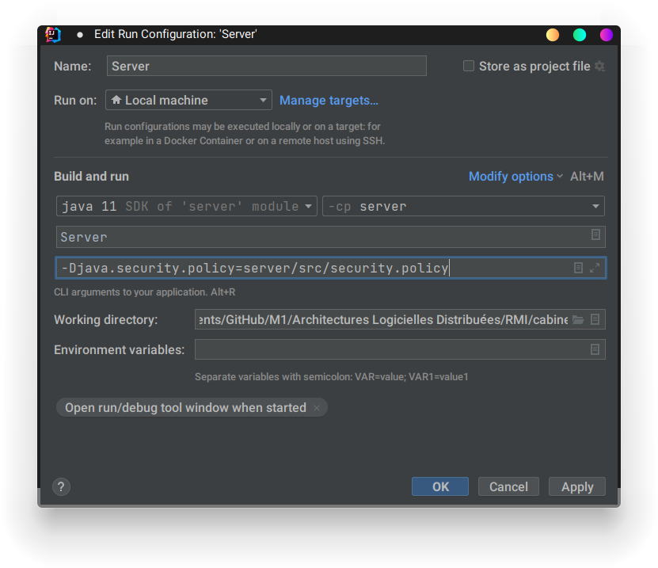

# Architectures Distribuées
## TP1: Java RMI, Cabinet Vétérinaire

### Projet rendu Par AMAH GNIMDOU RICHARD et Fanus Ludovic
## **Une premiere version simple**


Le code source du projet se trouve sur ce [Dépôt] (https://github.com/krxdow/M1/tree/master/Architectures%20Logicielles%20Distribu%C3%A9es/RMI/cabinetVet)

#### 1. Version de base

L’ensemble du projet est fait à l’aide de l’environment integré IntelliJ

```shell
.
├── client
│   ├── client.iml
│   └── src
│       └── Client.java
├── common
│   ├── common.iml
│   └── src
│       ├── Espece.java
│       ├── IAnimal.java
│       ├── ICabinetVeterinaire.java
│       ├── IEspece.java
│       └── ISuiviAnimal.java
├── readme.md
└── server
    ├── security.policy
    ├── server.iml
    └── src
        ├── Animal.java
        ├── CabinnetVeterinaireImpl.java
        ├── server.iml
        ├── Server.java
        └── SuiviAnimal.java
```
Dans un but de compartimenter le projet, le **server**, le **client** et **common** sont des modules.  
 **server** et client ont accesé à au module **common**, les modules **server** et **client** ne se voient pas


_Configuration via IntelliJ_  


---
#### 1. Version de base , mise en place de l'objet distant Animal
Ici l’objet distant est la classe Animal voici l’ensemble des étapes  

[l’interface](https://github.com/krxdow/M1/blob/3f19a61f52a41e5f1e0a1c76b8c36b3f65ba34b3/Architectures%20Logicielles%20Distribu%C3%A9es/RMI/cabinetVet/common/src/IAnimal.java) IAnimal qui extends **Remote**
````java
public interface IAnimal extends Remote { ... }
````
[L'implementation](https://github.com/krxdow/M1/blob/3f19a61f52a41e5f1e0a1c76b8c36b3f65ba34b3/Architectures%20Logicielles%20Distribu%C3%A9es/RMI/cabinetVet/server/src/Animal.java) (visible uniquement du côté serveur) qui hérite **UnicastRemoteObject** par héritage l’objet Animal va se comporter comme un stub fait office d’interface. 
````java
public class Animal extends UnicastRemoteObject implements IAnimal { ...}
````
Le server va distribuer objet, en créant ou cherchant un registre (`createRegistry` /`getRegistry`) et le lier au registre ici sous le nom d’animal , `registry.bind("Animale", animalStub);`
````java
public class Server { 
    public Server() {}
 public static void main(String[] args) throws RemoteException {
        Integer host = (args.length < 1) ? null : Integer.parseInt(args[0]);
        
        Animal animalStub = new Animal();
        Registry registry;
        
        try {
            try {
                registry = LocateRegistry.createRegistry(1099);
            } catch (RemoteException remoteException) {
                registry = LocateRegistry.getRegistry(1099);
            }
            
            registry.bind("Animale", animalStub);
        
        } catch (Exception e) {
            System.err.println("Server exception: " + e);
            e.printStackTrace();
        }
    }
}
````


#### 2. Gestionnaire de securité

Le RMISecurityManager applique la politique de sécurité pour les classes qui sont chargées en tant que stubs pour les objets distants,(ici dans notre cas la classe Animal )en remplaçant toutes les méthodes de contrôle d'accès pertinentes du SecurityManager. 
Par défaut, les objets stub ne sont autorisés qu'à effectuer des opérations de définition de classe et d'accès aux classe

La gestion des droits se fait à traver le fichier security.policy
```
grant {
  permission java.security.AllPermission;
};
```
Une premiere facon via le code avec l’objet RMISecurityManager  
petite astuce, la methode setProperty, accepte seulement le chemin absolu, afin que le projet soit exportable, ont utilse la methode **toAbsolutePath** classe Paths
```java
import java.nio.file.Paths;
import java.rmi.RMISecurityManager;
import java.rmi.registry.LocateRegistry;
import java.rmi.registry.Registry;

public class Server {

 public static void main(String[] args) {

  String path = Paths.get("server/src/security.policy").toAbsolutePath().toString();
  System.setProperty("java.security.policy", path);

  try {
   if (System.getSecurityManager() == null) {
    System.setSecurityManager(new RMISecurityManager());
   }
  } catch (Exception e) {
   e.printStackTrace();
  }
 }
}
```
ll est aussi possible d'activer un security manager en utilisant simplement l'option -Djava.security.manager de la JVM. 
```shell
java -Djava.security.manager -Djava.security.policy=security.policy 
```





#### 3. Class Suivi
On crée une interface et son implementation 


[ISuiviAnimal](https://github.com/krxdow/M1/blob/8b785d2485ec926cbcdafc5fdc9fe3e029d5c875/Architectures%20Logicielles%20Distribu%C3%A9es/RMI/cabinetVet/common/src/ISuiviAnimal.java)
```java
public interface ISuiviAnimal extends Remote {
    String getSuivi() throws RemoteException;
    void setSuivi(String s)  throws RemoteException;
    }
```
[SuiviAnimal](https://github.com/krxdow/M1/blob/8b785d2485ec926cbcdafc5fdc9fe3e029d5c875/Architectures%20Logicielles%20Distribu%C3%A9es/RMI/cabinetVet/server/src/SuiviAnimal.java)
```java
public class SuiviAnimal extends UnicastRemoteObject implements ISuiviAnimal {
    private String suivi;
    public SuiviAnimal() throws RemoteException {}
    public SuiviAnimal(String suivi) throws RemoteException {this.suivi = suivi;}
    public String getSuivi() throws RemoteException {return this.suivi;}
    public void setSuivi(String suivi) throws RemoteException {this.suivi = suivi;}
}
```


#### 4. Copies Espese
[Interface](https://github.com/krxdow/M1/blob/be6eec7b1d84a9a2c9f76ca0e686c72aa7950bb7/Architectures%20Logicielles%20Distribu%C3%A9es/RMI/cabinetVet/common/src/IEspece.java) et [l’Implementation](https://github.com/krxdow/M1/blob/be6eec7b1d84a9a2c9f76ca0e686c72aa7950bb7/Architectures%20Logicielles%20Distribu%C3%A9es/RMI/cabinetVet/common/src/Espece.java)


L'objet **Espese** (placé dans le module **common** )est pas un objets distants, n'est pas envoyé à travers le stub du server.  
Mais le client y accede donc ici l'interface **Espese** exentende serialization 
``` java
public interface IEspece extends Serializable {...}
```
L'objet Espese est convertir en un flux d'octets et ensuite réassemble les octets en une copie identique de l'objet d'origine. 

```java
public  class Client { 
    IAnimal stub = (IAnimal) registry.lookup("Animal");
    stub.setName("zack");
    Espece especeCopy = new Espece("canus lupus", 15);
    stub.setEspeseObj(especeCopy.getname(),especeCopy.getlifeExpectancy());
}
```
## **Classe CabinetVeterinaire**

[Interface](https://github.com/krxdow/M1/blob/be6eec7b1d84a9a2c9f76ca0e686c72aa7950bb7/Architectures%20Logicielles%20Distribu%C3%A9es/RMI/cabinetVet/common/src/ICabinetVeterinaire.java)  
[L’Implementation](https://github.com/krxdow/M1/blob/be6eec7b1d84a9a2c9f76ca0e686c72aa7950bb7/Architectures%20Logicielles%20Distribu%C3%A9es/RMI/cabinetVet/server/src/CabinnetVeterinaireImpl.java)

## **Création de Patient**

## **Téléchargement de Code**

## **Alerte**
